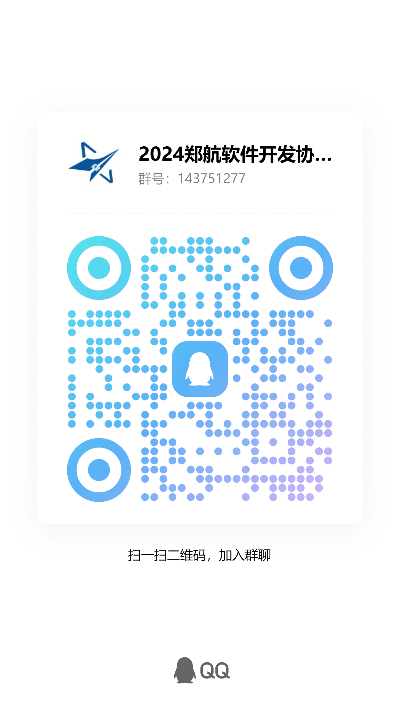

编程队是一支以培养学生编程兴趣和算法能力为目标的学生团队。我们不仅在校内提供丰富的编程语言、数据结构和算法学习资源，还积极组织各种程序设计竞赛训练，为同学们创造了广阔的实践交流平台。

在老师和学长的悉心指导下，我们的队员们不断提升编程技能，多次代表学校出征各类重大程序设计大赛，取得了丰硕的成绩。其中包括:ACM-ICPC省赛银奖、CCPC全国邀请赛铜奖、天梯赛全国总决赛铜奖、个人全国二等奖以及百度之星省赛金奖等。

我们致力于营造一个积极向上的学习交流氛围，鼓励同学之间的相互帮助和合作。通过专题讲座、集训等多种形式，我们帮助同学们不仅提高了编程能力，更培养了良好的数学思维和团队协作精神。

未来，编程队将继续发挥自身优势，为更多热爱编程的同学创造交流成长的平台，为学校培养更多优秀的算法人才做出应有贡献。


.jpg)
.jpg)
.jpg)


### 2024级招新开始啦！点击图片扫码二维码或搜索群号 143751277 加入我们~

